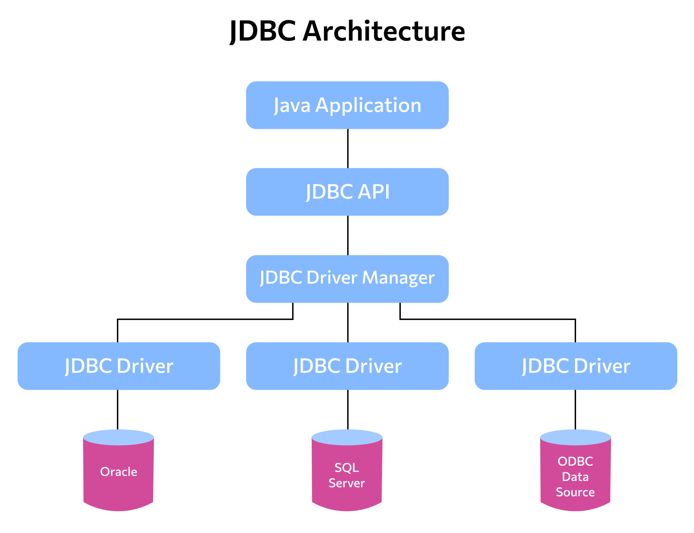

# SQL и группы запросов

## Что такое SQL

Язык программирования SQL появился в 1974 году, но до сих пор является неотъемлемой частью любого проекта, который взаимодействует с базами данных.

**SQL (Structured Query Language)** — это ****язык структурированных (т. е. создаваемых в соответствии с конкретным шаблоном) запросов, который используется для «общения» с реляционной базой данных. С его помощью можно создать базу и таблицу, а также получить необходимые данные, удалить или изменить их.

Помимо манипуляций с данными, SQL позволяет нам объединять различные группы данных, управлять доступом, оптимизировать работу с базой.

## Группы SQL (ddl, dml, dcl, tcl)

Разберемся, какие существуют группы операторов SQL.

1. Операторы **определения данных** (Data Definition Language, DDL):
- CREATE,
- ALTER,
- DROP.

Эта группа операторов используется, когда необходимо, например:

- создать таблицу — CREATE TABLE table_name…
- изменить таблицу — ALTER TABLE *table_name…*
- удалить таблицу — DROP TABLE *table_name…*

1. Операторы **манипуляции данными** (Data Manipulation Language, DML):
- SELECT,
- INSERT,
- UPDATE,
- DELETE.

Эти операторы используются в случаях, когда нужно:

- осуществить выборку данных — SELECT FROM *table_name…*
- положить данные в таблицу — INSERT INTO *table_name*...
- обновить данные в таблице — UPDATE *table_name…*
- удалить данные из таблицы — DELETE FROM *table_name…*

1. Операторы **определения доступа к данным** (Data Control Language, DCL):
- GRANT,
- REVOKE,
- DENY.

Данная группа операторов нужна:

- для назначения привилегий пользователям — GRANT SELECT ON…
- отмены привилегий — REVOKE SELECT ON…
- запрета действий для пользователя — DENY SELECT ON…

1. Операторы **управления транзакциями** (Transaction Control Language, TCL):
- COMMIT применяет транзакцию;
- ROLLBACK откатывает все изменения, сделанные в контексте текущей транзакции;
- SAVEPOINT разбивает транзакцию на более мелкие.

## Создание базы данных

Для того чтобы создать новую базу данных, необходимо прописать следующую команду:

**CREATE DATABASE database_name;**

Теперь база данных создана.

Чтобы приступить к работе с ней, если работа производится из командной строки, нужно подключиться к ней с помощью команды **\с database_name.**

## Создание таблицы

После того как база данных, в которой будет производиться работа, создана, нам нужно создать таблицу, которую мы будем наполнять данными.

**Таблица** — основной объект базы данных, предназначенный для хранения данных в структурированном виде.

Сделать это можно с помощью следующей команды:

**CREATE TABLE table_name;**

Однако не всё так просто. Для того чтобы создать таблицу корректно, то есть со всеми необходимыми столбцами, нам нужно перечислить эти столбцы при создании таблицы.

Предположим, что у нас есть библиотека и нам нужно создать базу данных, в которой будет информация о книгах, а именно:

- id каждого экземпляра книги,
- название книги,
- автор книги,
- количество экземпляров в библиотеке.

Создадим таблицу согласно параметрам, описанным выше:

**CREATE TABLE book (**

**id BIGSERIAL NOT NULL PRIMARY KEY,
title VARCHAR(60) NOT NULL,
author VARCHAR(60) NOT NULL,
amount INT NOT NULL**

**);**

Теперь разберемся, из чего состоит наша команда.

- **CREATE TABLE book (** — создать таблицу с названием book.
- **id BIGSERIAL NOT NULL PRIMARY KEY,** — ****в этой строке начинаются перечисления колонок.
  - **id** — название первой колонки. Такое название для первой колонки выбирают практически для любой таблицы в качестве уникального ключа.
  - **BIGSERIAL** — тип данных, которые будут содержаться в этой колонке. Означает числовой тип, который будет самостоятельно автоматически инкрементироваться (увеличиваться на единицу) при добавлении каждой новой записи в таблицу.
  - **NOT NULL** — данный параметр означает, что при добавлении новых данных в таблицу значение текущей колонки не может оставаться пустым.
  - **PRIMARY KEY** — этот параметр нарекает текущую колонку первичным ключом, то есть является идентификатором для сущности, хранимой в таблице.
- **title VARCHAR(60) NOT NULL,** — в этой строке также указаны параметры создания колонки.
  - **title** — название второй колонки. В ней будут храниться названия книг.
  - **VARCHAR(60)** — тип данных. Такой тип данных аналогичен типу String, то есть в этой колонке будет храниться информация в формате строки. А параметр 60, указанный в скобках, — это максимальное количество символов для этой строки.
  - **NOT NULL** — аналогично предыдущей колонке.
- **author VARCHAR(60) NOT NULL,** — данная строка по наполнению не отличается от предыдущей; разница в том, что тут мы создаем колонку, которая будет хранить информацию об именах авторов книг.
- **amount INT NOT NULL** — тут мы создаем последнюю колонку.
  - **amount** — название колонки. Этот столбец будет отвечать за информацию о количестве экземпляров каждой книги на остатках.
  - **INT** — тип данных. Означает хранение чисел.
  - **NOT NULL** — аналогично предыдущим колонкам.
- **);** — ****этими символами мы закрываем параметры создания таблицы и саму команду создания.

Теперь наша таблица создана, и мы можем наполнять ее данными.

Отдельно нужно упомянуть о том, как с помощью одной команды можно удалить таблицу. Эта команда выглядит следующим образом:

**DROP TABLE book;**

## Типы данных PostgreSQL

При создании нашей таблицы мы использовали такие типы данных, как:

- **BIGSERIAL**— целочисленный тип данных с автоматической инкрементацией при добавлении новых строк
- **VARCHAR** — строковый тип данных
- **INT**— целочисленный тип данных

Также популярными типами данных являются:

- **BOOLEAN**
- **DATE**
- **MONEY**

С полным списком типов данных, используемых при работе с PostgreSQL можно познакомиться на официальном сайте:

[https://www.postgresql.org/docs/current/datatype.html](https://www.postgresql.org/docs/current/datatype.html)

# Основные CRUD-операции

Практически все структуры данных имеют набор стандартных операций, которые выделяют в отдельную небольшую группу — CRUD-операции.

## Что такое CRUD

Для начала нужно разобраться, что такое CRUD-операции.

CRUD — это аббревиатура от:

- C — create
- R — read
- U — update
- D — delete

С операцией create мы уже познакомились, а чтобы нам применить на практике остальные, мы должны сначала наполнить нашу таблицу данными.

### Вставка данных

Вставить новые данные в таблицу можно с помощью оператора INSERT.

**INSERT INTO book (**

**title, author, amount)**

**VALUES ('War and Peace', 'L.N.Tolstoy', 5);**

Опять построчно разберем весь запрос.

- **INSERT INTO book (** — строка, в которой объявляется вставка данных в таблицу.
  - **INSERT INTO** — оператор вставки, без которого эта операция невозможна.
  - **book (** — ****название таблицы, в которую происходит вставка. Также в этой строке мы открываем скобки, в которых перечислим названия колонок.
- **title, author, amount)** — в данной строке мы перечисляем названия колонок, в которые будем вставлять новые данные, и закрываем скобки параметров.
- **VALUES ('War and Peace', 'L.N.Tolstoy', 5);** — в этой строке указаны данные, которые необходимо вставить.
  - **VALUES** — оператор, который указывает на информацию, подлежащую сохранению в таблице.
  - **('War and Peace', 'L.N.Tolstoy', 5)** — сами данные. Обратите внимание, что перечислять их надо в том же порядке, в котором были перечислены названия колонок в предыдущей строке.

  Также стоит заметить, что мы не указываем значения для колонки id, так как с помощью типа данных **BIGSERIAL** мы обозначили, что данные в этой колонке будут заполняться автоматически.

  ### Получение данных

  Для того чтобы получить все записи из таблицы, необходимо выполнить команду:

  **SELECT * FROM book;**

  С помощью оператора **SELECT** мы запрашиваем данные из таблицы.

  “ ***** ” (звездочка) — указывает на то, что мы хотим получить все записи.

  **FROM book** — эта часть запроса указывает на то, что мы хотим получить данные из таблицы book.

  В следующих уроках мы познакомимся с вами с выборкой данных по критериям.

  ### Обновление данных

  Для того чтобы обновить количество экземпляров конкретной книги, мы должны применить следующую команду:

  **UPDATE book SET amount = 10 WHERE id = 1;**

- **UPDATE** — этот оператор указывает на то, что мы хотим обновить данные.
- **book** — указывает таблицу, в которой будем обновлять данные.
- **SET** — сам оператор установки новых данных.
- **amount = 10** — после оператора установки данных указываем название колонки и после знака = прописываем новое значение.
- **WHERE** — этот оператор переводится как «где», то есть дает нам понять, для каких сущностей проводить обновление.
- **id = 1** — конкретное условие, которое должна соблюдать сущность, чтобы в ней произошло обновление данных.

Если у нас несколько колонок подлежат обновлению, то они перечисляются через запятую.

### Удаление данных

И, конечно, мы можем удалить запись из таблицы. Для этого нужно применить команду:

**DELETE FROM book WHERE id = 1;**

- **DELETE** — оператор удаления данных.
- **FROM book** — эта часть команды указывает на таблицу, из которой будет производиться удаление данных.
- **WHERE id = 1** — эта часть указывает на условие, которое должно соблюдать сущность, чтобы она была удалена из таблицы.

# Основные операторы

## Операторы WHERE, GROUP BY, ORDER BY и HAVING. Агрегатные функции

Выборка данных — одна из наиболее частых операций при обращении к базе данных. Мы с вами уже знакомы с командой **SELECT * FROM table_name**, ****однако зачастую нам приходится запрашивать хранимую в базе информацию не целиком, а по тем или иным критериям.

Также для нас может быть критичным формат вывода данных: например, группировка или сортировка выводимой информации. Для всех этих целей в языке SQL есть специальные операторы, которые мы будем использовать при запросах к базе.

## Агрегатные функции

Для начала давайте познакомимся с основными агрегатными функциями.

**Агрегатные функции** — функции, которые берут группы значений и сводят их к одиночному значению.

**SQL** предоставляет несколько агрегатных функций:

- **COUNT** — производит подсчет записей, удовлетворяющих условию запроса;
- **SUM** — вычисляет арифметическую сумму всех значений колонки;
- **AVG** — вычисляет среднее арифметическое всех значений;
- **MAX** — определяет наибольшее из всех выбранных значений;
- **MIN** — определяет наименьшее из всех выбранных значений.

## Оператор WHERE

Как правило, если у нас есть необходимость ограничить вывод данных каким-то условием, то мы применяем оператор **WHERE**.

Ранее мы с ним уже немного познакомились, когда обновляли данные в таблице и когда удаляли данные из нее. В том примере мы вычисляли необходимые для нас данные по столбцу id.

Давайте немного подробнее разберемся с этим оператором.

Если **WHERE** присутствует в запросе, то он будет располагаться следующим оператором после **FROM** (который указывает на таблицу, к которой мы обращаемся) и выполняться также будет следующим по порядку.

Условие, следующее за ключевым словом **WHERE**, ****может включать предикат условия поиска, булевские операторы **AND** (и), **OR** (или) и **NOT** (нет) и скобки, указывающие требуемый порядок вычислений.

Пример использования:

**SELECT * FROM book WHERE amount > 5;**

В результате такой команды мы получим выборку всех данных из таблицы book, количество экземпляров которых больше 5.

## Оператор GROUP **BY**

Следующим, после того как отработал оператор **WHERE**, в работу вступает оператор **GROUP BY.**
Оператор **GROUP BY** группирует данные при выборке, имеющие одинаковые значения в какой-то из колонок. Столбец, по которому осуществляется группировка, указывается после самого оператора.

Строки, не удовлетворяющие условию **WHERE**, исключаются перед тем, как данные будут сгруппированы.

При использовании **GROUP BY** все значения **NULL** считаются равными.

Пример использования:

**SELECT author AS Автор,**

**COUNT(title) AS книги,**

**SUM(amount) AS Количество_экземпляров**

**FROM book GROUP BY Автор;**

Результатом данного запроса будет информация об авторах, количестве их разных книг, а также общее количество экземпляров для каждого автора.

Обратите внимание, в данный запрос мы добавили новый оператор:

- **AS** — с помощью данного оператора мы можем в итоговой выборке создать новую колонку. Название новой колонки стоит справа от оператора, а информация, которая будет храниться, слева.

## Оператор **ORDER BY**

Оператор **ORDER BY** упорядочивает вывод запроса согласно значениям в том или ином количестве выбранных столбцов.

Возможно определить порядок по возрастанию ASC (от ascending — по возрастанию) или по убыванию DESC (descending — по убыванию) для каждого столбца. По умолчанию установлено возрастание.

При использовании **ORDER BY** можно задавать несколько условий порядка. Сначала данные сортируются, основываясь на их значениях для первого выражения. Строки с одинаковым значением для первого условия будут отсортированы по второму условию и т. д. 

**NULL**-элементы при сортировке по возрастанию всегда будут последними, а при порядке убывания — первыми.

При обозначении колонки, по которой будет происходить сортировка, можно использовать как ее название, так и ее порядковый номер.

Оператор **ORDER BY** располагается последним в запросе и исполняется также в самом конце.

Пример использования:

**SELECT author, title**

**FROM book**

**WHERE amount < 10**

**ORDER BY author DESC, title;**

В результате этой операции мы получим информацию об авторах и их книгах, которые есть в количестве менее 10 штук, в отсортированном виде, сначала по авторам в порядке, обратном алфавитному, а книги одного и того же автора будут отсортированы в натуральном порядке.

## Оператор HAVING

Оператор **HAVING** используется для фильтрации результата **GROUP BY** по заданным логическим условиям.

**HAVING** используется как **WHERE**, но в другой части SQL-выражения и, соответственно, на другой стадии формирования ответа.

**HAVING** стоит использовать в выражении только в том случае, когда в нем присутствует оператор **GROUP BY**. Условие поиска **HAVING** задает условие на группу строк сгруппированной таблицы.

Условие поиска раздела **HAVING** строится по тем же синтаксическим правилам, что и условие поиска раздела **WHERE**, ****и может включать те же самые предикаты.

Пример использования:

**SELECT author AS Автор,
AVG(amount) AS Среднее_количество_экземпляров
FROM book GROUP BY Автор
HAVING AVG(amount) > 10;**

Результатом этого запроса будет таблица из авторов и среднего количества всех экземпляров их книг при условии, что среднее количество экземпляров на остатке для одного автора больше 10.

## Операторы IN, BETWEEN, LIKE

## ****Оператор BETWEEN****

Логическое выражение после ключевого слова **WHERE** может включать оператор **BETWEEN.**

Оператор **BETWEEN** позволяет отобрать данные, относящиеся к некоторому интервалу, включая его границы.

Пример использования:

**SELECT title, amount
FROM book
WHERE amount BETWEEN 8 AND 12;**

Результатом этой команды будет выборка из названия и количества тех книг, количество которых от 8 до 12 включительно.

## ****Оператор IN****

Этот оператор, так же как и **BETWEEN**, ****может присутствовать в выражении, стоящем после оператора **WHERE.** Оператор ****IN**** позволяет выбрать данные, соответствующие значениям из списка.

Пример использования:

**SELECT title, amount
FROM book
WHERE author IN ('L.N.Tolstoy');**

Данный запрос выведет все книги и их количество, у которых автором является Л. Н. Толстой.

## ****Оператор LIKE****

Оператор ****LIKE**** используется для сравнения строк. Этот оператор позволяет сравнивать строки не только на полное соответствие, но и в соответствии с шаблоном. Шаблоном могут быть **обычные символы**, а также **символы-шаблоны**.

Какие есть символы-шаблоны:

- **%** — любая строка, содержащая ноль или более символов.
    - **SELECT * FROM book WHERE title LIKE 'A%’** — вернет все записи, в которых название книги начинается на букву А.
- **_** (подчеркивание) — любой одиночный символ.
    - **SELECT * FROM book WHERE author LIKE 'N.V._ _ _ _ _’** — вернет все записи, в которых инициалы автора Н. В., а фамилия состоит из 5 букв.

При сравнении с шаблоном его обычные символы должны в точности совпадать с символами, указанными в строке. Символы-шаблоны могут совпадать с произвольными элементами символьной строки.


## Операторы NOT, AND и OR

****Логическое выражение после ключевого слова **WHERE** может включать с себя логические операции **NOT, AND и OR.**

**AND** — оператор, который отображает только те записи, когда первое и второе условие возвращает **true**.

Пример использования:

**SELECT * FROM book
WHERE author = 'N.V.Gogol' AND amount > 10;**

Данный запрос вернет все записи, где автором является Гоголь, а количество экземпляров больше 10.

**OR** — оператор, который отображает только те записи, когда хотя бы одно из двух условий возвращает **true**.

Пример использования:

**SELECT * FROM book
WHERE author = 'N.V.Gogol' OR amount > 10;**

Этот запрос вернет все записи, в которых автором является Гоголь или количество экземпляров больше 10.

**NOT** — оператор отрицания.

Пример использования:

**SELECT * FROM book**

**WHERE NOT author = 'N.V.Gogol';**

В данном случае вернутся все записи, в которых автор не Гоголь.

# Вложенные запросы

SQL позволяет создавать вложенные запросы.

**Вложенный запрос,** или **подзапрос,** — это запрос внутри другого запроса SQL.

Вложенный запрос используется для выборки данных, которые будут использоваться в условии отбора записей основного запроса. Его применяют:

- для проверки того, выбирает ли запрос определенные строки;
- сравнения выражения с результатом вложенного запроса;
- определения того, включено ли выражение в результаты вложенного запроса;

Вложенный запрос имеет следующие компоненты:

- Ключевое слово SELECT, после которого указываются имена столбцов или выражения.
- Ключевое слово FROM, после которого необходимо указать имя таблицы, из которой будут выбираться данные.
- А также WHERE, GROUP BY и HAVING, которые являются необязательными.

Пример использования:

**SELECT * FROM book
WHERE amount = (**

**SELECT MIN(amount)
FROM book**

**);**

Результатом данной команды будет вся информация о книге с наименьшим количеством экземпляров.

Вложенный запрос в данном случае необходим для того, чтобы получить сначала минимальное значение для колонки amount.

# Индексы

**Индекс (index)** — объект базы данных, создаваемый с целью повышения
производительности выборки данных.

Наборы данных могут иметь большое количество записей, которые хранятся в
произвольном порядке, и их поиск по заданному критерию путем последовательного
просмотра набора данных запись за записью может занимать много времени.

Индекс формируется из значений одного или нескольких полей и указателей на соответствующие записи набора данных. Таким образом достигается значительный прирост скорости выборки из этих данных.

**Преимущества** использования индексов:

- Ускорение поиска и сортировки по определенному полю или набору полей.
- Обеспечение уникальности данных.

**Недостатки** при использовании индексов:

- Требование дополнительного места на диске и в оперативной памяти. И чем больше и длиннее ключ, тем больше размер индекса.
- Замедление операций вставки, обновления и удаления записей, поскольку при этом

  приходится обновлять сами индексы.


Индексы предпочтительней:

- для поля-счетчика, чтобы в том числе избежать и повторения значений в этом поле;
- поля, по которому проводится сортировка данных;
- полей, по которым часто проводится соединение наборов данных. Поскольку в этом случае данные располагаются в порядке возрастания индекса и соединение происходит значительно быстрее.
- поля, которое объявлено первичным ключом (primary key);
- поля, в котором данные выбираются из некоторого диапазона. В этом случае, как только будет найдена первая запись с нужным значением, все последующие значения будут расположены рядом.

Использования индексов нецелесообразно:

- для полей, которые редко используются в запросах;
- полей, которые содержат всего два или три значения, например: мужской, женский пол или значения «да», «нет».

Как правило, индексы создаются на один столбец.

Создать индекс можно с помощью специальной конструкции:

**CREATE INDEX index_name (Ex: table_name_column_name_idx)**

**ON table_name(column_name);**

Например, для таблицы book создание индекса по столбцу авторов выглядит следующим образом:

**CREATE INDEX book_author_idx ON book(author);**

После создания индекса SQL-запросы остаются неизменными.

Если нам необходимо удалить индекс, то это можно сделать с помощью команды:

**DROP** **book_author_idx**;

# Связи между таблицами

Язык SQL позволяет нам получать данные и работать с ними не только из одной таблицы, но и из нескольких одновременно. Условием для этого является **связь** между этими таблицами. Давайте подробнее рассмотрим способы связывания таблиц между собой.

### Первичный ключ (primary key)

**Первичный ключ (primary key)** — это одно или несколько полей в таблице. Первичный ключ необходим для **уникальной идентификации** любой строки.

Первичный ключ накладывает некоторые ограничения на колонку:

- Все записи, относящиеся к первичному ключу, должны быть уникальны. Это означает, что если первичный ключ состоит из одного поля, то все записи в нем должны быть уникальными. А если первичный ключ состоит из нескольких полей, то комбинация этих записей должна быть уникальна, но в отдельных полях допускаются повторения.
- Записи в полях, относящихся к первичному ключу, не могут быть пустыми. Для этого при создании первичного ключа используется ограничение NOT NULL.
- У каждой таблицы может быть только один primary key.

**Потенциальный ключ** — простой или составной ключ, который уникально идентифицирует каждую запись набора данных.

При этом потенциальный ключ должен обладать критерием неизбыточности, то есть при удалении любого из полей набор полей перестает уникально идентифицировать запись.
Из множества всех потенциальных ключей набора данных выбирают первичный ключ, все остальные ключи называют альтернативными.

Как мы уже выяснили, primary key отвечает за идентификацию каждой строки. Помимо этого, благодаря первичному ключу в SQL можно связать несколько таблиц. Для этого необходимы первичный ключ одной таблицы и внешний ключ другой таблицы.

### Внешний ключ (foreign key)

**Внешний ключ** **(foreign key)** — это один или несколько столбцов, значения которых зависят от первичного ключа другой таблицы. Это ограничение используется для объединения двух таблиц.

В PostgreSQL внешний ключ помогает создать связь между таблицами, делая одну таблицу родительской, а другую дочерней. Внешний ключ можно обозначить в момент создания таблицы.

При создании зависимой (дочерней) таблицы (таблицы, которая содержит внешние ключи) необходимо учитывать, что:

- каждый внешний ключ должен иметь такой же тип данных, как связанное поле главной таблицы;
- необходимо указать главную для нее таблицу и столбец, по которому осуществляется связь:

```
FOREIGN KEY (связанное_поле_зависимой_таблицы)
REFERENCES главная_таблица (связанное_поле_главной_таблицы)
```

Для внешних ключей рекомендуется устанавливать ограничение NOT NULL.

Пример использования:

Сейчас в таблице, с которой мы работали, авторы записаны в формате «инициалы.фамилия».  А что, если нам придется менять этот формат на полное ФИО? Тогда, учитывая, что в нашей таблице может быть с десяток книг от каждого автора, нам придется менять очень много строчек. В связи с этим было бы оптимальным вынести авторов в отдельную таблицу и связать две полученные таблицы.

Для начала давайте удалим имеющуюся у нас таблицу book:

**DROP TABLE book;**

Давайте вместо ранее созданной нами таблицы создадим две новые, связанные по автору.

1. Создаем таблицу с авторами:

   **CREATE TABLE author (**

   **author_id BIGSERIAL NOT NULL PRIMARY KEY,**

   **name_author VARCHAR(60)**

   **);**

   В данной записи вам должно быть всё знакомо.

  - Создаем таблицу с названием author.
  - Создаем в ней колонку, которая будет в качестве первичного ключа и имеет целочисленный автоматически инкрементируемый тип данных.
  - Добавляем колонку с именем автора, имеющую строковый тип данных.
2. Теперь создадим связанную таблицу по аналогии с той, которая у нас была ранее, только вместо имени автора в ней будет присутствовать внешний ключ, указывающий на колонку author_id из главной таблицы.

**CREATE TABLE book (**

**book_id BIGSERIAL NOT NULL PRIMARY KEY,
title VARCHAR(60) NOT NULL,
author_id INT NOT NULL,
amount INT NOT NULL,
FOREIGN KEY (author_id)  REFERENCES author (author_id)**

**);**

### ****Связь One to Many****

Связь ****One to Many**** существует тогда, когда одной записи главной таблицы соответствуют несколько записей связанной таблицы, а каждой записи связанной таблицы соответствует только одна запись главной таблицы.

Из нашего примера понятно, что один автор из главной таблицы может иметь несколько книг из связанной, при этом каждая книга могла быть написана только одним автором.

Это и есть пример связи «**один ко многим**».

### ****Связь Many to Many****

Однако в реальной жизни может быть немного иначе. Например, к созданию одной книги могут приложить руку сразу два автора. В таком случае не только у одного автора может быть несколько книг, но и у одной книги может быть сразу несколько авторов.

Такой случай будет являться примером связи «**многие ко многим**».

Связь ****Many to Many**** существует тогда, когда одной записи из первой таблицы соответствуют несколько записей во второй. И наоборот, каждой записи второй таблицы соответствуют несколько записей в первой.

## JOIN

**JOIN** — оператор языка SQL, который является реализацией операции соединения для нескольких таблиц. Предназначен для обеспечения выборки данных из двух таблиц и включения этих данных в один результирующий набор.

Операции соединения имеют следующие особенности:

- в схему таблицы-результата входят столбцы обеих исходных таблиц (таблиц-операндов), то есть схема результата является «сцеплением» схем операндов;
- каждая строка таблицы-результата является «сцеплением» строки из одной таблицы-операнда со строкой второй таблицы-операнда;
- при необходимости соединения не двух, а нескольких таблиц операция соединения применяется несколько раз (последовательно).

Существуют три типа JOIN-выражений:

- INNER JOIN
- OUTER JOIN
- CROSS JOIN

### INNER JOIN

При использовании INNER JOIN (внутреннее соединение) результатом объединения таблиц являются записи, общие для левой и правой таблиц. Порядок таблиц для оператора не важен, поскольку оператор является симметричным.


SELECT column_name FROM table1_name {INNER | {LEFT | RIGHT | FULL} OUTER | CROSS } JOIN table2_name
ON some_condition; (table1_name.column_name  = table2_name.column_name)

Пример использования:

**SELECT name_author, title**

**FROM author**

**INNER JOIN book**

**ON author.author_id = book.author_id;**

В результате этого запроса мы получим названия книг и их авторов.

### OUTER JOIN

OUTER JOIN (внешнее соединение) разделяется на несколько видов:

- **LEFT (OUTER) JOIN** — производит выбор всех записей первой таблицы и соответствующих им записей второй таблицы. Если записи во второй таблице не найдены, то вместо них подставляется пустой результат (NULL). Порядок таблиц для оператора важен, поскольку оператор не является симметричным.


Пример использования:

**SELECT name_author, title**

**FROM author LEFT JOIN book**

**ON author.author_id = book.author_id**

**ORDER BY name_author;**

Результатом этого запроса будут имена авторов и названия их книг. Если книги каких-то авторов отсутствуют, то вместо названия будет NULL.

- **RIGHT (OUTER) JOIN**, ****по сути, является тем же самым LEFT JOIN, только с операндами, расставленными в обратном порядке. Порядок таблиц для оператора важен, поскольку оператор не является симметричным.


- **FULL (OUTER) JOIN** — результатом объединения таблиц являются все записи, которые присутствуют в таблицах. Порядок таблиц для оператора не важен, поскольку оператор является симметричным.


Пример использования:

**SELECT name_author, title**

**FROM author FULL OUTER JOIN book**

**ON author.author_id = book.author_id**

**ORDER BY name_author;**

Результатом этого запроса будут имена всех авторов и названия всех их книг. Если у какого-то автора нет книг в библиотеке или автор какой-то книги отсутствует в базе, то таких значения будут помечены NULL.

### CROSS JOIN

CROSS JOIN реализует перекрестное соединение таблиц, или декартово произведение (все возможные пары из данных таблиц). При выборе каждая строка одной таблицы объединяется с каждой строкой второй таблицы, давая тем самым все возможные сочетания строк двух таблиц. Порядок таблиц для оператора не важен, поскольку оператор является симметричным.


Пример использования:

**SELECT name_author, title
FROM author
CROSS JOIN book;**

Результатом такого запроса будет таблица, в которой каждому автору будет соответствовать каждая книга вне зависимости от того, кто ее написал.

# Нормальные формы

### Н**ормализация**

**Нормализация** — это процесс преобразования таблицы базы данных к виду, отвечающему нормальным формам.

Другими словами, это пошаговый обратимый процесс замены исходной таблицы другой таблицей, в которой наборы данных имеют более простую и логичную структуру.

Нормализация:

- предназначена для приведения структуры БД к виду, обеспечивающему минимальную логическую избыточность;
- не имеет целью уменьшение/увеличение производительности работы или уменьшение/увеличение физического объема БД;
- конечная цель — уменьшение потенциальной противоречивости хранимой в БД информации.

**Какие существуют нормальные формы?**
1. Первая нормальная форма (1NF) — таблица находится в 1NF, если значения всех ее атрибутов атомарны (неделимы).
2. Вторая нормальная форма (2NF) — таблица находится в 2NF, если она находится в 1NF и при этом все неключевые атрибуты зависят только от ключа целиком, а не от какой-то его части.
3. Третья нормальная форма (3NF) — таблица находится в 3NF, если она находится в 2NF и все неключевые атрибуты не зависят друг от друга.
4. Четвертая нормальная форма (4NF) — таблица находится в 4NF, если она находится в 3NF и если в ней не содержатся независимые группы атрибутов, между которыми существует отношение «многие ко многим».
5. Пятая нормальная форма (5NF) — таблица находится в 5NF, когда каждая нетривиальная (не единичная) зависимость соединения в ней определяется потенциальным ключом (ключами) этого отношения.
6. Шестая нормальная форма (6NF) — таблица находится в 6NF, когда она удовлетворяет всем нетривиальным зависимостям соединения, т. е. когда она неприводима, то есть не может быть подвергнута дальнейшей декомпозиции без потерь. Каждая переменная таблицы, которая находится в 6NF, также находится и в 5NF. Введена как обобщение пятой нормальной формы для хронологической базы данных.
7. Нормальная форма Бойса — Кодда, усиленная 3-я нормальная форма (BCNF) — таблица находится в BCNF, когда каждая ее нетривиальная и неприводимая слева функциональная зависимость имеет в качестве своего детерминанта некоторый потенциальный ключ.
8. Доменно-ключевая нормальная форма (DKNF) — таблица находится в DKNF, когда каждое наложенное на нее ограничение является логическим следствием ограничений доменов и ограничений ключей, наложенных на данную таблицу.

### **Денормализация**

**Денормализация базы данных** — это процесс осознанного приведения базы данных к виду, в котором она не будет соответствовать правилам нормализации.

Обычно это необходимо для повышения производительности и скорости извлечения данных за счет увеличения избыточности данных.

# Введение в JDBC

## Введение в JDBC

На предыдущих уроках мы взаимодействовали с базой данных и с информацией, которая в ней хранится напрямую через командную строку.

Но все-таки, так как умение работать с базами данных нам требуется в процессе разработки, то и к информации у нас должен быть доступ напрямую из среды разработки.

Для этого у разработчиков есть инструмент — **JDBC.**

**JDBC** (Java DataBase Connectivity — соединение с базами данных на Java)  представляет собой стандартный API, который предназначен для взаимодействия Java-приложения с различными системами управления базами данных (СУБД).

**JDBC** позволяет устанавливать соединение с базой данных согласно специально описанному URL с помощью драйверов, которые могут загружаться во время работы программы динамически.



# Maven

## Maven

В коммерческой разработке проекты зачастую очень масштабные и даже составные, которые могут содержать в себе несколько подпроектов. А также состоят из большого количества сторонних библиотек.

Собирать все это вместе руками в один большой корректно работающий проект будет очень сложно. Для облегчения этой задачи существуют различные инструменты для автоматизации сборки проектов.

Одним из наиболее популярных таких инструментов является **maven.**

maven - фреймворк, который отвечает за автоматизацию сборки проектов, а также позволяет легко управлять зависимостями для проекта.

maven создает локальный репозиторий в памяти машины и загружает туда все необходимые библиотеки для быстрого доступа к ним.

Основным инструментом самого мейвена является файл pom.xml

pom.xml(*Project Object Model*) - файл, который представляет собой декларативное описание проекта, то есть содержит конкретные спецификации, на основе которых и происходит сборка проекта, такие как зависимости и плагины.

Зачастую в качестве источника необходимых элементов используется ресурс [https://mvnrepository.com/](https://mvnrepository.com/)

Maven использует принцип *Maven-архетипов*.

Архетип — это инструмент шаблонов, каждый из которых определён паттерном или моделью. Благодаря применению того или иного архетипа мы получаем стандартную структуру каталогов(пакетов).

maven также определяет жизненный цикл проекта.

Жизненный цикл maven-проекта — это список поименованных фаз, определяющий порядок действий при его построении. Жизненный цикл Maven содержит три независимых порядка выполнения:

- clean — жизненный цикл для очистки проекта. Содержит следующие фазы:
  1. pre-clean
  2. clean
  3. post-clean
- default — основной жизненный цикл, содержащий следующие фазы:
  1. validate — выполняется проверка, является ли структура проекта полной и правильной.
  2. compile — компилируются исходные тексты.
  3. test — собранный код тестируется заранее подготовленным набором тестов.
  4. package — упаковка откомпилированных классов и прочих ресурсов. Например, в JAR-файл.
  5. install — установка программного обеспечения в локальный Maven-репозиторий, чтобы сделать его доступным для других проектов текущего пользователя.
  6. deploy — стабильная версия программного обеспечения распространяется на удаленный Maven-репозиторий, чтобы сделать его доступным для других пользователей.
- site — жизненный цикл генерации проектной документации. Состоит из фаз:
  1. pre-site
  2. site
  3. post-site
  4. site-deploy

# Соединение с базой и таблицей

## Соединение с базой и таблицей

Давайте в нашем пакете java создадим класс Application, в котором будем пока подключаться к базе и первый раз попробуем взаимодействовать с базой именно в этом классе.

Создаем в классе метод main и в нем создаем 3 строковые переменные:

- **user** - эта строка отвечает за логин при подключении к базе, по-умолчанию является “postgres”
- **password** - пароль для подключения к базе. Нужно прописать тот, который вы установили при установке инструментов базы и которым пользовались при работе с командной строкой
- **url** - адрес, по которому мы сможем найти нашу базу. Содержит указание сервера, порта и название самой базы, внутри которой мы будем работать: “jdbc:postgresql://localhost:5432/skypro”

Стоит сделать эти переменные финальными.

Далее в конструкции try with resources нам необходимо создать 2 ресурса:

1. `final Connection connection = DriverManager.*getConnection*(url, user, password)` - тут мы формируем само наше соединение с базой данных.
   Для этого нам необходимо создать объект класса `Connection` из стандартного пакета java.sql. Создам соединение с помощью статического метода *`getConnection` принадлежащего классу* `DriverManager` из того же пакета java.sql. Класс `DriverManager` как видно из названия отвечает за драйвера для подключения к конкретному типу базы данных. А в параметр метода мы как раз передаем созданные нами переменные.
2. `PreparedStatement statement = connection.prepareStatement("SELECT * FROM book WHERE book_id = (?)")` - в данном случае мы создаем объект класса `PreparedStatement`. Этот класс подготовить запрос к базе данных и выполнить его. В данном случае мы у созданного нами объекта `connection` вызываем метод `prepareStatement`, в параметр которого передаем запрос.
   Обратите внимание, что в запросе присутствует wildcard(?). В это место мы дальше сможем подставить необходимое для нас значение.

Далее выполняем метод `statement.setInt(1, 6)`. С помощью данного метода мы как раз подставляем необходимое значение. В параметр метода передаем порядковый номер конкретного wildcard в запросе (в данном случае он у нас первый и единственный), а также значение, которое хотим поставить на его место.

После этого наш запрос к базе готов к выполнению. Но поскольку мы хотим сделать выборку данных, то нам эти данные нужно куда-то положить.

Для этого в пакете java.sql есть интерфейс ResultSet

**ResultSet** представляет результирующий набор данных и обеспечивает приложению построчный доступ к результатам запросов. При обработке запроса **ResultSet** поддерживает указатель на текущую обрабатываемую строку.

Доступ к данным **ResultSet** обеспечивает посредством набора get-методов, которые организуют доступ к колонкам текущей строки. Метод ResultSet.next используется для перемещения к следующей строке ResultSet, делая ее текущей.

```java
final ResultSet resultSet = statement.executeQuery();
```

С помощью данной команды мы создаем объект, который ссылаем на интерфейс `ResultSet` и наполняем его данными, которые получаем из таблицы.
У объекта `statement` мы вызываем метод `executeQuery`, которым отправляем наш запрос в базу.

Далее с помощью цикла while проходим по всем данным, которые получили благодаря нашему запросу и используем их в наших целях.
В данном случае мы создадим переменные соответствующих типов и присвоим им значения из объекта `resultSet`.

Сделать это мы можем с помощью методов getInt и getString.

```java
String titleOfBook = "Title: " + resultSet.getString("title");
String authorOfBook = "Author_id: " + resultSet.getString("author_id");
int amountOfBook = resultSet.getInt(4);
```

Обратите внимание, что в параметр методов getInt и getString мы можем передавать как название колонки из базы данных, так и порядковый номер колонки.

А далее мы можем распоряжаться полученными данными так как мы пожелаем. Например, можем вывести в консоль.

Полный пример кода выглядит так:
```java
import java.sql.*;

public class Application {

    public static void main(String[] args) throws SQLException {

				// Создаем переменные с данными для подключения к базе
        final String user = "postgres";
        final String password = "5833118";
        final String url = "jdbc:postgresql://localhost:5432/skypro";

				// Создаем соединение с базой с помощью Connection
				// Формируем запрос к базе с помощью PreparedStatement
        try (final Connection connection = DriverManager.getConnection(url, user, password);
             PreparedStatement statement = connection.prepareStatement("SELECT * FROM book WHERE book_id = (?)")) {

						// Подставляем значение вместо wildcard
            statement.setInt(1, 6);

						// Делаем запрос к базе и результат кладем в ResultSet
            final ResultSet resultSet = statement.executeQuery();

						// Методом next проверяем есть ли следующий элемент в resultSet
						// и одновременно переходим к нему, если таковой есть
            while (resultSet.next()) {

								// С помощью методов getInt и getString получаем данные из resultSet
                String titleOfBook = "Title: " + resultSet.getString("title");
                String authorOfBook = "Author_id: " + resultSet.getString("author_id");
                int amountOfBook = resultSet.getInt(4);

								// Выводим данные в консоль
                System.out.println(titleOfBook);
                System.out.println(authorOfBook);
                System.out.println("Amount: " + amountOfBook);

            }
        }
    }
}


/*
Результатом в консоли будет:

Title: Uncle Vanya
Author_id: 4
Amount: 10
*/
```